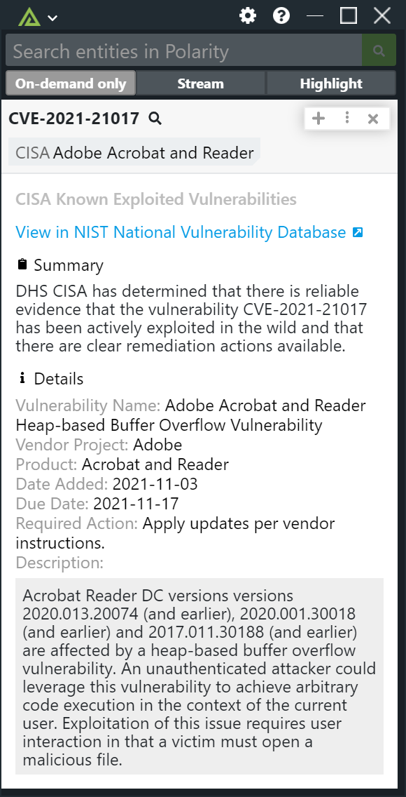

# Polarity DHS CISA Known Exploited Vulnerabilities Integration

The Polarity - DHS CISA Known Exploited Vulnerabilities Integration returns information on vulnerabilities (CVEs) that have been identified by CISA as meeting the following criteria:

1. The vulnerability has an assigned Common Vulnerabilities and Exposures (CVE) ID.
2. There is reliable evidence that the vulnerability has been actively exploited in the wild.
3. There is a clear remediation action for the vulnerability, such as a vendor provided update.

The integration requires network access to the CISA Known Vulnerability List available here: https://www.cisa.gov/sites/default/files/feeds/known_exploited_vulnerabilities.json

The integration will automatically refresh the list every night at midnight.  The list is also reloaded any time the integration is restarted.

Check out the integration below:

To learn more about the DHS CISA Known Exploited Vulnerabilities, please visit https://www.cisa.gov/known-exploited-vulnerabilities

## Installation Instructions

Installation instructions for integrations are provided on the [PolarityIO GitHub Page](https://polarityio.github.io/).

## Polarity

Polarity is a memory-augmentation platform that improves and accelerates analyst decision making.  For more information about the Polarity platform please see:

https://polarity.io/
